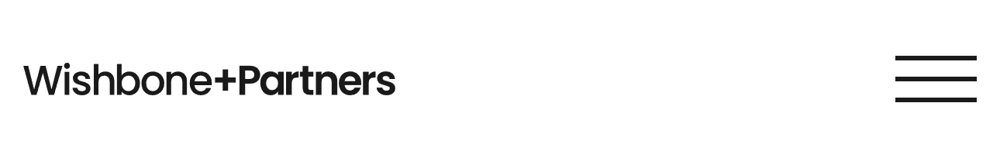
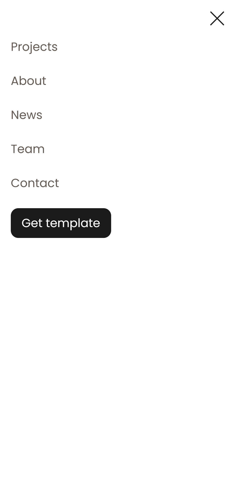

# Wishbone

### 📜 Лицензия
Этот проект распространяется под лицензией **MIT**.  
Подробнее см. [LICENSE](LICENSE).

## Описание проекта 
Wishbone — это сайт архитектурного магазина, он написан на NextJS и Tailwind.

### Функционал

- Адаптивный дизайн
- На мобильных устройствах бургер меню
- Анимации при скроле
- Анимации при наведении, фокусировании и нажатии

### Технологии

- Frontend: NextJS, TypeScript, Tailwind, Framer-Motion. 
  
  
  
  
- Дизайн: Figma
  

## Установка:

  1) Клониррвание репозитория:
   
  ```bash
  git clone https://github.com/BlackDarkes/Wishbone.git
  ```

  2) Запуск:

  Node.js >= 18.x
  npm >= 9.x
  ```bash
  npm i && npm run dev
  ```

## Пример кода

  ```TypeScript
  import { CSSProperties, ReactNode } from "react";

  interface IContainerProps {
    children: ReactNode;
    size: "extra" | "max" | "midle" | "smole";
    style?: CSSProperties;
    className?: string;
  }

  export const Container = ({
    className,
    style,
    children,
    size,
  }: IContainerProps) => {
    return (
      <div
        style={style}
        className={`mx-auto flex items-center justify-between ${
          size === "extra" ? "w-[min(100%-20px,1440px)]" :
          size === "max" ? "w-[min(100%-20px,1320px)]" : 
          size === "midle" ? "w-[min(100%-20px,1200px)]" : 
          size === "smole" ? "w-[min(100%-20px,768px)]" : ""
        } ${className ? className : ""}`}
      >
        {children}
      </div>
    );
  };

  ```

## Структура проекта

     project/  
    ├── public/       
    ├── src/        
    ├── next.config        
    ├── tsconfig       
    └── README.md   
    └── LICENSE.md  

## Изображения проекта:
1. Desktop: 
   
  *Рис. 1: Главная страница сайта в десктопной версии.* 

2. Mobile:
   

   *Рис. 2: Главная страница сайта в мобильной версии.*

   

   *Рис. 3: Header сайта в мобильной версии.*

   

   *Рис. 4: Burger menu сайта в мобильной версии.*

